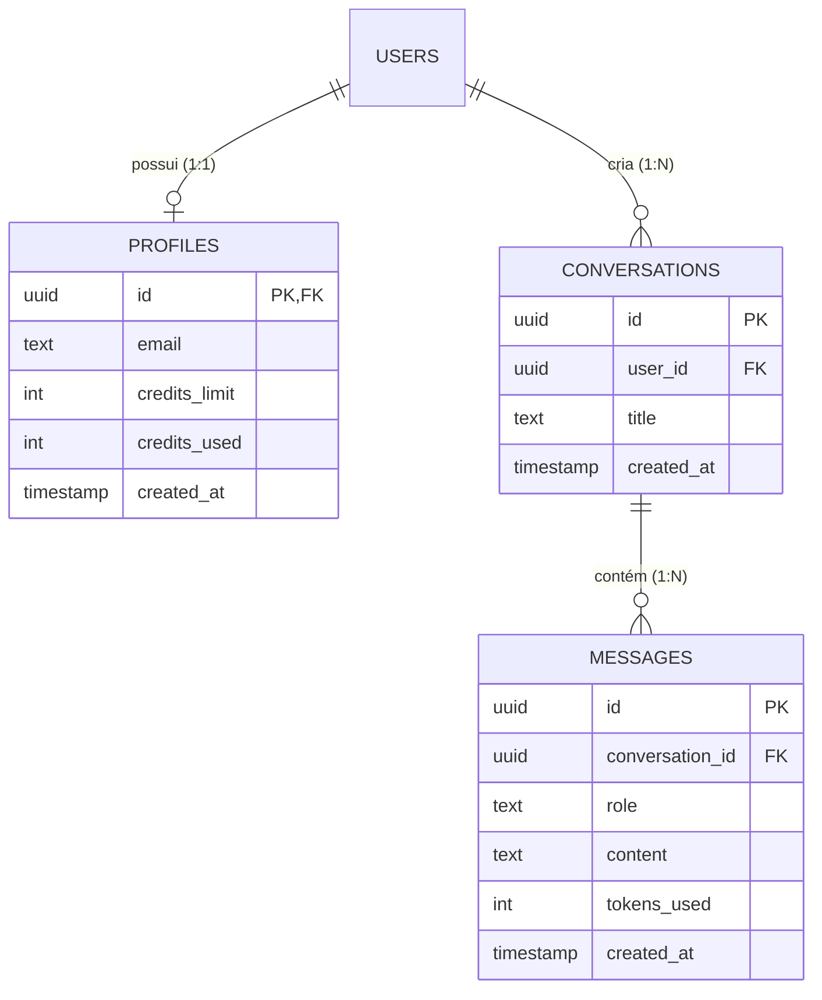

# AI SaaS Starter
> **Stack:** Next.js 15 (App Router) + Supabase (PostgreSQL / Auth / RLS) + OpenAI & Gemini (Streaming HTTP) + Tailwind CSS + TypeScript

---

## 🎯 Propósito do Projeto

Ele demonstra a solução completa de desafios reais enfrentados por produtos SaaS de IA:
1. **Consumo de Streaming HTTP em Tempo Real**: Renderização fluida de tokens com zero latência percebida via `ReadableStream` e `TransformStream`.
2. **Integração Resiliente com LLMs**: Pipeline unificado com suporte nativo a **OpenAI** (`gpt-4o-mini`) e fallback automático para **Google Gemini** (`gemini-3.8-flash`).
3. **Controle Estrito de Cotas & Rate Limit**: Validação de saldo de créditos no servidor antes de chamar a IA e persistência assíncrona após o término da transmissão.
4. **Arquitetura de Dados & Segurança com Supabase**: Modelagem relacional em PostgreSQL, triggers automatizados, stored procedures atômicas e **Row Level Security (RLS)** para isolamento absoluto dos dados dos usuários.
5. **Modo Sandbox / Zero-Config**: Sistema com fallback simulado para permitir que avaliadores e recrutadores testem a interface e os fluxos instantaneamente, mesmo sem configurar credenciais externas.

---

## 🏗️ Arquitetura do Fluxo de Dados

Abaixo está o ciclo de vida de uma requisição de chat na aplicação:

```
[ Usuário ] 
    │ Envia mensagem
    ▼
[ Client (React 19 / Next.js) ]
    │ POST /api/chat { conversationId, messages }
    ▼
[ Next.js Edge / Server Route ]
    │
    ├─► 1. [ Middleware de Quota / Supabase ]
    │      Verifica saldo de créditos na tabela 'profiles'.
    │      Se saldo esgotado ──► Retorna HTTP 403 (Quota Exceeded).
    │
    ├─► 2. [ LLM Stream Provider ]
    │      Chama OpenAI ou Gemini com streaming ativado.
    │
    ├─► 3. [ HTTP TransformStream (Em Tempo Real) ]
    │      Encaminha pedaços (chunks) imediatamente para o Client
    │      enquanto acumula o texto completo em buffer de memória.
    │
    └─► 4. [ Background Persistence (on flush) ]
           Ao concluir o stream:
           - Persiste a mensagem na tabela 'messages'.
           - Executa a Stored Procedure atômica 'increment_user_credits'.
```

---

## ⚡ Principais Competências Demonstradas

### 1. Streaming HTTP sem Buffering
- Utilização de `Response(responseStream, { headers: { 'Content-Type': 'text/plain; charset=utf-8' } })`.
- No cliente, a leitura é feita com `response.body.getReader()`, decodificando `Uint8Array` progressivamente através de `TextDecoder`.
- Suporte a cancelamento em tempo real com `AbortController`.

### 2. Controle de Créditos e Modelo de Negócio SaaS
- Cada usuário tem limites definidos (`credits_limit` e `credits_used`).
- A aplicação bloqueia chamadas não autorizadas no backend antes de consumir qualquer token da API de IA.
- Interface reativa com feedback de progresso em tempo real e modal de upgrade caso atinja o limite.

### 3. Segurança com Row Level Security (RLS)
- Nenhuma consulta ou escrita no banco depende unicamente da regra da aplicação: o próprio PostgreSQL aplica políticas onde `auth.uid() = user_id`.
- Um usuário jamais consegue visualizar conversas ou mensagens de outro usuário, mesmo que tente manipular requisições manualmente.

---

## 🗄️ Modelagem do Banco de Dados (PostgreSQL)

O schema está versionado em [`supabase/schema.sql`]:



### Automações no Banco:
- **Trigger `on_auth_user_created`**: Cria automaticamente o perfil com 20 créditos iniciais no momento em que o usuário se cadastra.
- **Function `increment_user_credits`**: Atualização atômica concorrente segura (`credits_used = credits_used + amount`), evitando *race conditions*.

---

## 📁 Estrutura do Projeto

```text
├── app/
│   ├── api/chat/route.ts      # Endpoint de streaming, validação de cotas e persistência
│   ├── globals.css            # Configuração de estilos globais e Tailwind CSS
│   ├── layout.tsx             # Layout raiz com fontes e metadados
│   └── page.tsx               # Interface do dashboard de chat (painel, histórico e stream)
├── components/
│   ├── auth/                  # Formulário de autenticação (Login / Cadastro)
│   ├── dashboard/             # Componentes da interface: Sidebar, ChatArea, Modais
│   └── ui/                    # Componentes base (Button, Dialog, Tooltip, Input, etc.)
├── lib/
│   ├── ai/stream.ts           # Integração unificada OpenAI / Gemini / Fallback
│   └── supabase/              # Clientes Supabase (browser/servidor) e emulador sandbox
└── supabase/
    └── schema.sql             # Script DDL com tabelas, RLS, triggers e procedures
```

---

## 🛠️ Tecnologias Utilizadas

- **Framework:** [Next.js 15](https://nextjs.org/) (App Router, React 19)
- **Linguagem:** [TypeScript](https://www.typescriptlang.org/)
- **Estilização:** [Tailwind CSS v4](https://tailwindcss.com/) + Radix UI + Lucide React
- **Animações:** [Motion](https://motion.dev/)
- **Inteligência Artificial:** [OpenAI API](https://platform.openai.com/) & [@google/genai](https://ai.google.dev/)
- **Banco de Dados & Auth:** [Supabase](https://supabase.com/) (PostgreSQL 15+, RLS, Stored Procedures)
- **Markdown Rendering:** `react-markdown` + `remark-gfm`

---

## 🚦 Como Executar Localmente

### 1. Clonar o repositório e instalar as dependências
```bash
git clone https://github.com/LaGiGa/ai-saas-starter.git
cd ai-saas-starter
npm install
# ou bun install / pnpm install
```

### 2. Configurar as Variáveis de Ambiente
Copie o arquivo de exemplo:
```bash
cp .env.example .env.local
```

Preencha as variáveis em `.env.local`:
```env
# Chave da OpenAI (ou Gemini)
OPENAI_API_KEY="sk-..."
GEMINI_API_KEY="AIzaSy..."

# Configuração do Supabase
NEXT_PUBLIC_SUPABASE_URL="https://seu-projeto.supabase.co"
NEXT_PUBLIC_SUPABASE_ANON_KEY="sua-chave-anon"
SUPABASE_SERVICE_ROLE_KEY="sua-chave-service-role"
```

> 💡 **Nota (Modo Sandbox):** Caso você queira testar a interface de imediato sem configurar o Supabase ou chaves de IA, basta rodar o projeto diretamente. A aplicação detecta a ausência de chaves e ativa automaticamente o **Modo Sandbox Interativo** com armazenamento local e respostas simuladas!

### 3. Configurar o Banco no Supabase (Opcional se usar Sandbox)
1. Acesse o painel do seu projeto no [Supabase](https://supabase.com).
2. Vá até o **SQL Editor**.
3. Copie o conteúdo de [`supabase/schema.sql`] e execute.

### 4. Executar o Servidor de Desenvolvimento
```bash
npm run dev
```

Abra [http://localhost:3000](http://localhost:3000) no seu navegador para ver a aplicação em execução.

---

## 👤 Autor

Desenvolvido por **Laércio** como demonstração de competências em engenharia de software para soluções de IA.
